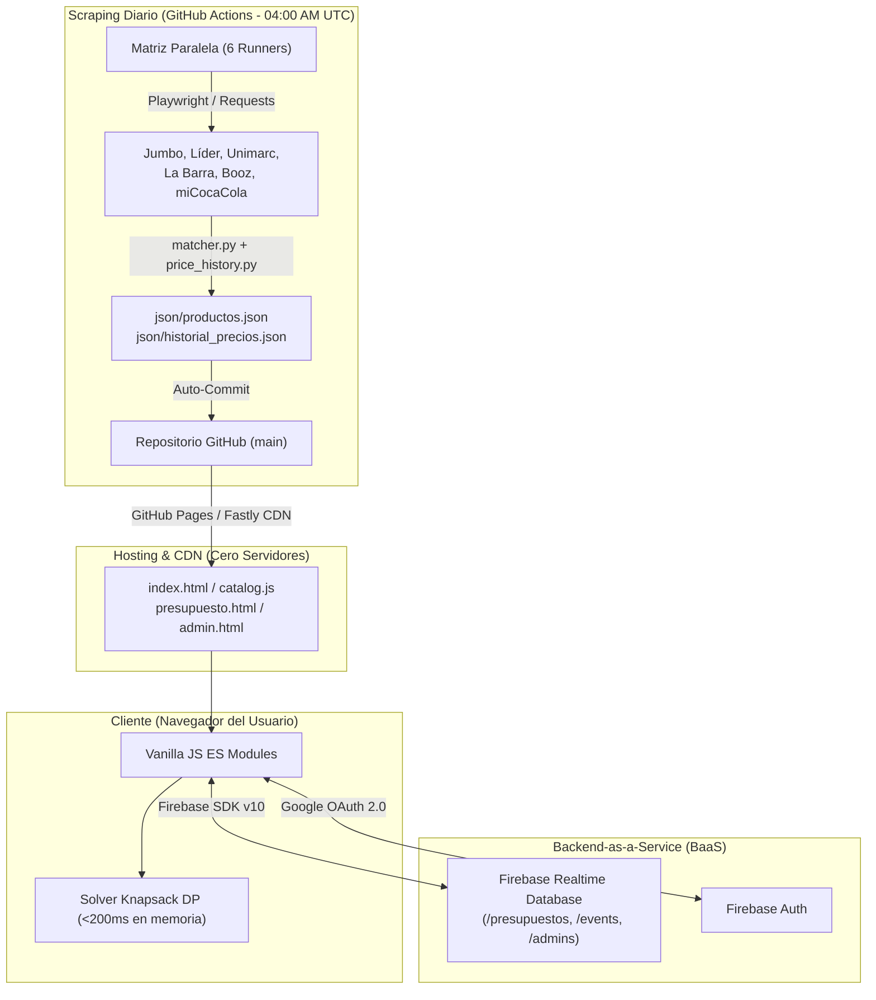

# 🍻 Cuánto Rinde — Calculadora de Copete & Comparador de Precios

> **El motor de optimización y arbitraje de retail para carretes en Chile.**  
> *Calcula la combinación matemáticamente óptima de alcohol y mixers al menor precio, compara ofertas en tiempo real entre los principales supermercados y botillerías de Chile, y comparte la cuota por persona vía WhatsApp.*

[](https://pipin333.github.io/calculadoracopete/)
[](https://github.com/Pipin333/calculadoracopete/actions/workflows/scrape_prices.yml)
[](LICENSE)
[](docs/MASTER_DOCUMENTATION.md)

---

## 📑 Tabla de Contenidos

1. [Visión y Propuesta de Valor](#-visión-y-propuesta-de-valor)
2. [Características Principales](#-características-principales)
3. [Arquitectura y Stack Tecnológico ($0 OPEX)](#-arquitectura-y-stack-tecnológico-0-opex)
4. [Estructura del Repositorio](#-estructura-del-repositorio)
5. [Motor Matemático: Knapsack DP (<200ms)](#-motor-matemático-knapsack-dp-200ms)
6. [Pipeline de Scraping Autónomo (GitHub Actions)](#-pipeline-de-scraping-autónomo-github-actions)
7. [Postura de Ciberseguridad (OWASP Top 10)](#-postura-de-ciberseguridad-owasp-top-10)
8. [Consola de Fundador & Telemetría Lean](#-consola-de-fundador--telemetría-lean)
9. [Guía de Desarrollo Local](#-guía-de-desarrollo-local)
10. [Créditos & Comunidad](#-créditos--comunidad)

---

## 🎯 Visión y Propuesta de Valor

En Chile, organizar un carrete o junta siempre enfrenta dos grandes fricciones:
1. **Asimetría de información y dispersión de precios:** El pisco, las cervezas y las bebidas varían fuertemente de precio entre Jumbo, Líder, Unimarc, La Barra o botillerías especializadas.
2. **La coordinación de "La Vaca":** Determinar cuánto debe poner cada persona, qué comprar para que alcance y quién va a qué tienda genera discusiones y compras ineficientes.

**Cuánto Rinde** resuelve esto modelando el problema como una **optimización combinatoria continua (Knapsack Covering)** con datos de retail actualizados a diario:
* **Entradas:** Número de personas, cuota por cabeza (o modo sin cuota fija), tipo de evento ("Modo Previa", "Pongámosle", "Modo 18 🇨🇱", "Trabajo mañana"), gama de destilados y preferencias de mixer.
* **Salidas:** Dos planes de compra instantáneos:
  * **Compra Óptima (Multi-tienda):** La combinación matemática que minimiza el gasto cruzando tiendas.
  * **Compra Simple (Tienda Única):** La mejor opción si el grupo solo quiere hacer una parada física.
* **Boleta Compartible:** Enlace único de 6 caracteres (`/presupuesto.html?id=...`) generado con entropía criptográfica para viralizar por WhatsApp con el desglose exacto por persona.

---

## 🚀 Características Principales

### 1. 🛒 Catálogo & Vitrina SoloTodo-Style (`catalog.js`)
* **Comparador de Retail:** Vitrina visual con fotos de stock en alta resolución para cervezas, destilados y mixers.
* **Mínimos Históricos a 6 Meses:** Badges destacados (`🔥 Mínimo Histórico`, `📉 X% vs promedio`) calculados desde series temporales (`historial_precios.json`).
* **Modal "Elige tu tienda":** Desglose de cada producto en todas las tiendas con su precio, diferencia respecto al más barato y enlace directo de compra (`rel="noopener noreferrer"`).
* **CTA Integrado:** Botón *"Cotizar en Calculadora ⚡"* que precarga la categoría directamente en la herramienta de presupuesto.

### 2. 🧮 Motor de Optimización Knapsack Ultrarrápido (`solver.js`)
* Algoritmo de programación dinámica reescrito con **TypedArrays planos (`Float64Array`, `Uint32Array`)**, máscaras de bits (*bitmasks*) y *backtracking*.
* Latencia de cálculo reducida de **>15 segundos a menos de 200 milisegundos**, ejecutada 100% en el navegador del cliente sin congelamiento de UI.

### 3. 🏷️ Gamas Realistas de Consumo Chileno
* **Rata 🐀 (De combate/Universitario):** Capel, Eristoff, Blenders Pride, etc.
* **Normal 🍺 (Estándar):** Mistral 35°, Alto del Carmen 35°, Absolut, Ballantine's, etc.
* **Sobrado 🥃 (Premium):** El Gobernador, Horcón Quemado, Grey Goose, Hendrick's, Jack Daniel's, etc.

### 4. 🔗 Presupuestos Compartibles en Tiempo Real
* Generación de enlaces cortos con **CSPRNG** (`window.crypto.getRandomValues`).
* Persistencia dual: **Firebase Realtime Database** en la nube con fallback transparente a `localStorage`.

### 5. 📊 Consola de Fundador (`admin.html`)
* Dashboard administrativo protegido mediante **Google OAuth 2.0** y lista blanca de UIDs en `/admins`.
* Telemetría anónima de carretes calculados, cuota promedio, asistentes promedio y gráficos interactivos de tiendas y tragos más populares con **Chart.js**.

---

## 🏗️ Arquitectura y Stack Tecnológico ($0 OPEX)

El proyecto opera bajo una arquitectura **Lean JAMstack / Serverless**, logrando rendimiento sub-segundo con **cero costo fijo mensual**:



| Capa | Tecnología | Función | Costo |
| :--- | :--- | :--- | :---: |
| **Frontend** | HTML5, CSS3, Bootstrap 5.3.3, Vanilla JS (ES Modules) | Interfaz móvil-first reactiva y sin frameworks pesados | \$0 |
| **Cómputo Cliente** | TypedArrays (`Float64Array`, `Uint32Array`), Bitmasks | Solver Knapsack en memoria del navegador del usuario | \$0 |
| **Visualización** | Chart.js 4.x | Gráficos ejecutivos en consola de fundador e historial de precios | \$0 |
| **Hosting & CDN** | GitHub Pages (Fastly CDN global) | Entrega de archivos estáticos y caching en el borde (*edge*) | \$0 |
| **Base de Datos & Auth**| Firebase Realtime Database & Firebase Auth | Presupuestos compartidos, telemetría y consola de fundador | \$0 |
| **ETL & Scraping** | Python 3.11, Playwright, BeautifulSoup4, Regex Matcher | Extracción, normalización y cálculo de series temporales | \$0 |
| **CI / CD** | GitHub Actions (Ubuntu Runners en paralelo) | Scraping diario y despliegue automático a producción | \$0 |

---

## 🗂️ Estructura del Repositorio

```text
calculadoracopete/
├── index.html                    # Calculadora principal y vitrina interactiva
├── presupuesto.html              # Boleta compartible (vista independiente con boleta visual)
├── admin.html                    # Consola de Fundador (telemetría y analítica)
├── database.rules.json           # Reglas de seguridad endurecidas de Firebase RTDB
├── css/
│   └── styles.css                # Sistema de diseño con variables CSS y modo oscuro
├── javascript/
│   ├── script.js                 # Orquestador principal de la calculadora
│   ├── catalog.js                # Módulo de catálogo, vitrina y comparador SoloTodo
│   ├── solver.js                 # Algoritmo Knapsack DP de alto rendimiento (<200ms)
│   ├── renderer.js               # Renderizado de resultados, modales y enlaces a tiendas
│   ├── helpers.js                # Utilidades, formateo CLP y escapeHTML (anti-XSS)
│   ├── productApi.js             # API de productos, opciones de consumo y caché
│   ├── productImages.js          # Mapeo de fotos de stock de alta calidad
│   ├── mixerPreferences.js       # Gestor de preferencias de bebidas para mezclar
│   ├── budgetSliders.js          # Control de sliders de presupuesto
│   ├── firebase-config.js        # Cliente Firebase SDK (RTDB, Auth y telemetría)
│   ├── shorturl.js               # Generador de URLs cortas con CSPRNG criptográfico
│   └── config.js                 # Configuración de márgenes, penalizaciones y marcas
├── json/
│   ├── productos.json            # Base de datos activa (~167 SKUs normalizados)
│   └── historial_precios.json    # Historial de precios a 6 meses para mínimos históricos
├── workers/
│   ├── run.py                    # Runner CLI (--store, --merge)
│   ├── matcher.py                # Regex parser de volumen/unidades, fuzzy match y gama
│   ├── price_history.py          # Motor de series temporales y cálculo de promedios
│   ├── config.json               # Configuración de tiendas, queries y selectores
│   ├── requirements.txt          # Dependencias Python
│   └── scrapers/
│       ├── jumbo.py              # Scraper Jumbo (HTTP + React Query State)
│       ├── lider.py              # Scraper Líder
│       ├── labarra.py            # Scraper La Barra (CCU)
│       └── playwright_scrapers.py # Scraper unificado Playwright (Unimarc, Booz, miCocaCola, Líquidos)
└── .github/workflows/
    ├── scrape_prices.yml         # Cron diario a las 04:00 AM UTC (Matriz de 6 tiendas en paralelo)
    └── static.yml                # Despliegue automático a GitHub Pages
```

---

## 🛡️ Postura de Ciberseguridad (OWASP Top 10)

El repositorio fue auditado y blindado contra el estándar **OWASP Top 10 (2021)**:

* **A01: Broken Access Control:**
  * Se eliminaron las reglas descendentes en cascada en Firebase RTDB.
  * El control de acceso administrativo se aisló en el nodo `/admins` con `.write: "false"`.
  * Los presupuestos compartidos solo se pueden leer por su clave individual (`$presupuestoId`), bloqueando cualquier intento de volcado masivo mediante `GET /presupuestos.json`.
* **A03: Injection & Stored XSS:**
  * Se implementó `escapeHTML()` en [`helpers.js`](javascript/helpers.js) para codificar todas las variables inyectadas en `innerHTML` tanto en `admin.html`, `presupuesto.html` como `catalog.js`.
  * Se sanitizan enlaces salientes con `sanitizeURL()` y se fuerza `rel="noopener noreferrer"` en los hipervínculos externos.
* **A02: Cryptographic Failures:**
  * La generación de IDs cortos en [`shorturl.js`](javascript/shorturl.js) utiliza **CSPRNG** (`window.crypto.getRandomValues`), eliminando la predictibilidad de `Math.random()`.
* **A05: Security Misconfiguration & Clickjacking:**
  * Cabeceras **Content-Security-Policy (CSP)** implementadas vía `<meta>` restringiendo orígenes a dominios autorizados de Google, Firebase y CDNs legítimos.
  * Script defensivo anti-framing (*Frame Buster*) para prevenir ataques de Clickjacking / UI Redressing.
  * Integridad de subrecursos (**SRI**) en librerías externas de Bootstrap.

---

## 💻 Guía de Desarrollo Local

### 1. Levantar la Aplicación Web

Al ser una aplicación basada en módulos ES nativos, requiere servirse bajo protocolo HTTP (no abrir directamente vía `file://`):

```bash
# Clonar el repositorio
git clone https://github.com/Pipin333/calculadoracopete.git
cd calculadoracopete

# Servir con Python 3
python -m http.server 8000

# O con Node.js (npx serve)
npx serve .
```
Abre tu navegador en `http://localhost:8000`.

### 2. Ejecutar los Scrapers de Retail

```bash
cd workers
python -m venv venv
# En Windows:
.\venv\Scripts\activate
# En Linux/Mac:
source venv/bin/activate

pip install -r requirements.txt
playwright install chromium

# Scrapear una tienda específica:
python run.py --store Jumbo
python run.py --store Unimarc
python run.py --store "La Barra"

# Consolidar resultados y calcular mínimos históricos:
python run.py --merge
```

### 3. Ejecutar Pruebas Automatizadas (Playwright)

```bash
# Prueba de neutralización de XSS y renderizado E2E:
python scratch/test_xss_defense.py
```

---

## 👥 Créditos & Comunidad

* **Creador & Arquitectura:** [Pipin333](https://github.com/Pipin333)
* **Tech Lead / Colaborador:** Chela
* **QA & Feedback de Campo:** Santi

*Cuánto Rinde nació como una herramienta para solucionar la logística de las previas y juntas universitarias en Chile y hoy es un sistema de ingeniería de optimización abierto, auditable y de alto rendimiento.*

¿Tienes sugerencias, encontraste un bug o quieres agregar un nuevo supermercado? **¡Abre un Issue o Pull Request!** 🇨🇱🍻
